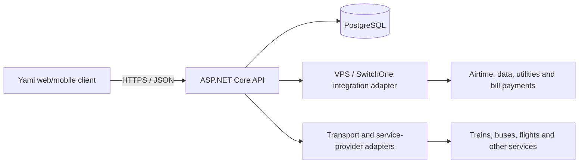

# Yami Super App

Yami is a South African super-app prototype that brings payments, transport, utilities, connectivity, entertainment and everyday services into one mobile-first experience.

[View the live demo](https://yami-super-app.vercel.app/tabs/home/home) · [Backend repository](https://github.com/radebeinnovations/mzansipay-backend-api)

> **Project status:** Portfolio-quality interactive demo with an integration-ready backend foundation. The published demo uses mock data and does not move real money. Live provider integrations, production authentication and regulatory onboarding are still in progress.

## Product overview

Yami is designed around one account and one wallet. A customer can discover a service, complete its journey inside Yami and pay from the same balance instead of moving between unrelated apps.

The current demo includes:

- Wallet balance, send money, request money, withdrawals and card deposits
- Telecom experiences for Vodacom, MTN, Telkom and Cell C
- Electricity and water purchases
- PRASA train search, fares, booking flow and trip management
- Intercity bus search and booking
- Flight search and booking demo
- DStv package selection and payment
- Food ordering and checkout
- Insurance, savings, investments, vouchers and school-fee service concepts
- Shared transaction history and account screens
- Responsive layouts for phone and desktop demonstrations

## Architecture



The client never needs direct access to database credentials or provider secrets. Those integrations belong behind the ASP.NET Core API, where authentication, validation, idempotency, logging and reconciliation can be enforced consistently.

## Technology stack

### Client and demo

- HTML5, CSS3 and vanilla JavaScript for the custom mini-app experiences
- Existing Ionic, Angular and Cordova web shell assets
- Browser `localStorage` for demo-only wallet state and transaction continuity
- SVG and CSS-based icons for consistent mobile rendering
- Vercel for the public static demo

### Backend

- C# and ASP.NET Core Web API on .NET 10
- Entity Framework Core with the Npgsql PostgreSQL provider
- Kestrel for local API hosting
- REST health endpoints for application and database readiness
- Controller-ready structure for wallet, provider and payment APIs

### Data layer

- PostgreSQL 18 for local development
- UUID primary keys
- `numeric(19,4)` monetary values to avoid floating-point errors
- JSONB fields for provider request and response auditing
- Unique idempotency keys to reduce duplicate transaction risk
- Constraints and indexes for wallet, provider and reconciliation queries

## PostgreSQL model

The initial schema is maintained in the backend repository at `db/001_initial_schema.sql`.

- `app_users` — customer identity and contact details
- `wallets` — one ZAR wallet per customer
- `ledger_entries` — auditable credits and debits
- `provider_transactions` — external purchase lifecycle and provider references
- `webhook_events` — deduplicated provider callbacks
- `reconciliation_batches` — daily settlement and reconciliation totals

This is the foundation of the server-side wallet ledger. The balance shown in the current web demo is still simulated locally and must not be treated as a real stored-value account.

## Repository structure

```text
assets/                  Images, icons and application assets
authentication/          Authentication and lock-screen routes
tabs/home/home/           Main Yami dashboard route
prasa.html                PRASA interactive demo
quickbus.html             Intercity bus demo
flights.html              Flight demo
food.html                 Food-ordering demo
dstv.html                 DStv demo
yami-electricity.html     Electricity flow
yami-water.html           Water flow
yami-money.html           Wallet actions
yami-wallet.js            Shared demo wallet state
yami-history.html         Transaction history
yami-account.html         Account and security UI
yami-shell.js             Shared navigation and mini-app shell
vercel.json               Static hosting and route configuration
```

## Run the web demo locally

From the repository root:

```bash
python3 -m http.server 8080
```

Then open:

```text
http://localhost:8080/tabs/home/home
```

Do not open the HTML files directly with a `file://` URL; serving the folder over HTTP keeps routes and assets consistent.

## Run the backend locally

The backend lives in the separate [mzansipay-backend-api](https://github.com/radebeinnovations/mzansipay-backend-api) repository.

```bash
dotnet restore
export ConnectionStrings__YamiDatabase="Host=127.0.0.1;Port=5432;Database=yami_dev;Username=yami_app;Password=YOUR_LOCAL_PASSWORD"
dotnet run --project src/Yami.Api --urls http://127.0.0.1:5050
```

Health checks:

```text
GET http://127.0.0.1:5050/health
GET http://127.0.0.1:5050/health/db
```

Passwords, API keys and provider credentials must be supplied through environment variables or a production secret manager and must never be committed to Git.

## Integration strategy

The intended production flow is:

1. The client submits a validated purchase request to the Yami API.
2. The API creates a transaction using a unique idempotency key.
3. A provider adapter sends the request to the approved QA or production endpoint.
4. The result is recorded in PostgreSQL and the wallet ledger is updated atomically.
5. Webhooks or status polling complete delayed transactions.
6. Reconciliation compares Yami records with provider settlement reports.

The VPS/SwitchOne work is currently at onboarding and QA preparation stage. A fixed outbound IP, QA credentials, current API specification, service codes, certificates, retry rules and reconciliation procedures are required before a real integration can be enabled.

## Security and production requirements

- TLS for all client, API and provider traffic
- Server-side authentication and role-based authorization
- Secure password/PIN hashing and token rotation
- Secrets stored outside source control
- Strict input validation and rate limiting
- Idempotent payment and provider requests
- Append-only financial ledger with atomic database transactions
- Webhook signature validation and replay protection
- Audit logging, monitoring, alerting and daily reconciliation
- POPIA-aligned data handling and retention controls
- PCI-compliant hosted/tokenized card capture; Yami should not store raw PAN or CVV data
- Independent security review and applicable South African financial/regulatory approvals before launch

## Delivery status

### Implemented

- [x] Responsive Yami dashboard and service catalogue
- [x] Interactive mini-app demos and shared demo balance
- [x] PRASA, bus, flight, telecom, utilities, DStv and food journeys
- [x] ASP.NET Core API foundation
- [x] PostgreSQL schema and Entity Framework Core mapping
- [x] API and database health checks
- [x] Public Vercel deployment

### In progress / planned

- [ ] Production user authentication and authorization
- [ ] Server-backed wallet and double-entry ledger operations
- [ ] VPS/SwitchOne QA integration and certification
- [ ] Card gateway tokenization and 3-D Secure
- [ ] Live transport inventory and booking-provider APIs
- [ ] Webhook processing, retries, reversals and refunds
- [ ] Reconciliation jobs, operational dashboard and alerting
- [ ] Automated unit, integration, security and end-to-end tests
- [ ] Cloud backend deployment with a fixed outbound IP
- [ ] Android and iOS production packaging and store release

## Portfolio summary

Designed and developed a mobile-first South African super-app prototype combining a shared digital wallet with transport, utilities, telecommunications, entertainment and commerce mini-apps. Built interactive frontend journeys, an ASP.NET Core/.NET 10 API foundation and a PostgreSQL transaction schema designed around UUIDs, idempotency, provider audit data and reconciliation readiness.

## Important notice

Yami is currently a demonstration environment. All balances, purchases, bookings, cards and confirmations in the public demo are simulated. Brand names are used to communicate integration concepts and do not imply endorsement or a completed commercial partnership.

Developed for **Mzansi FinTech**.
